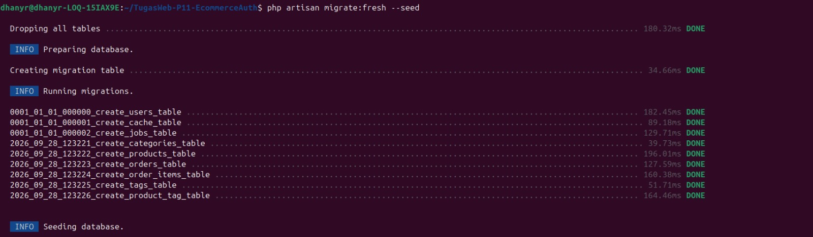
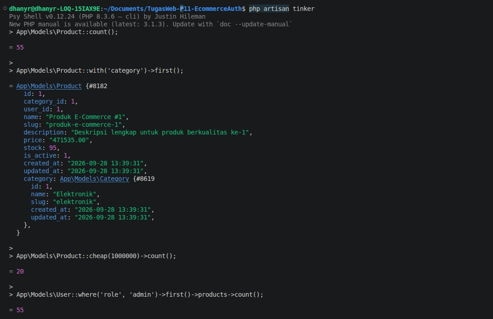
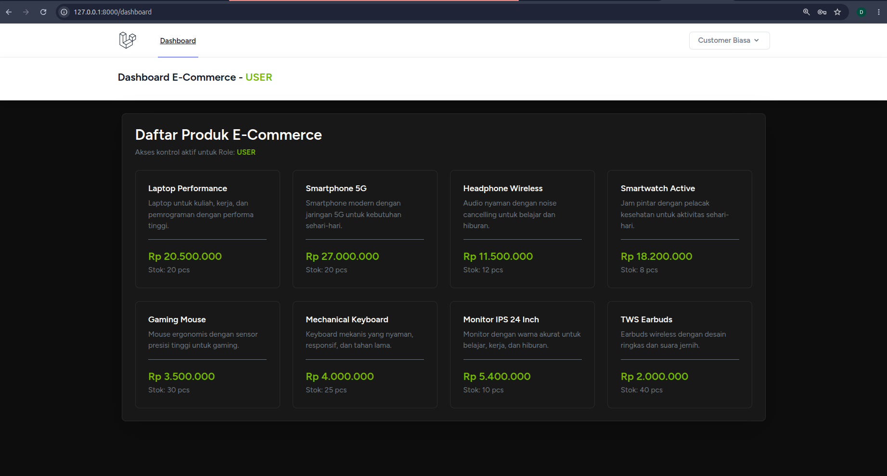
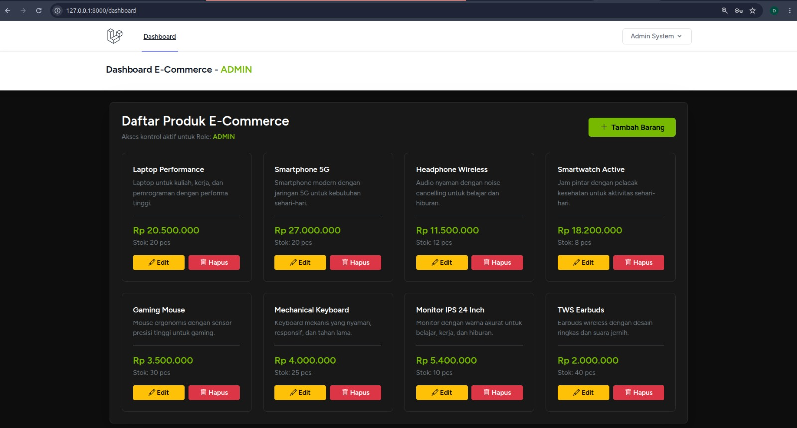
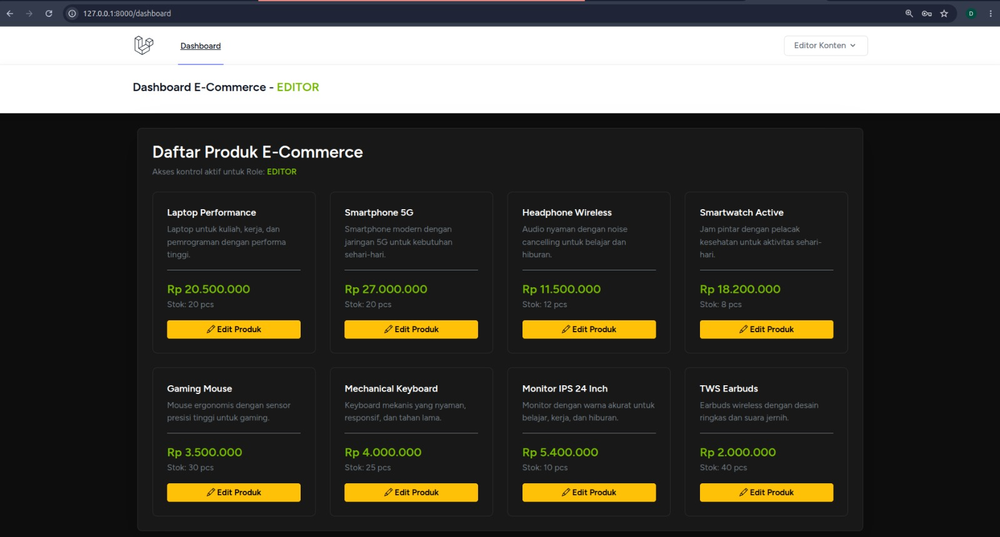
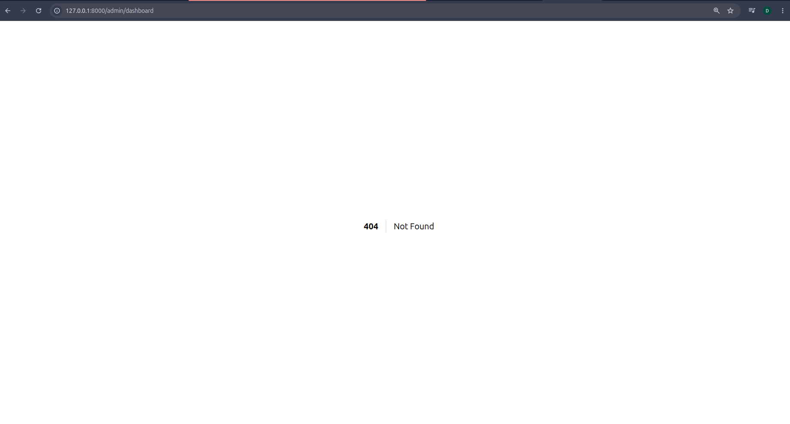

# 🛒 Tugas Rutin 11: E-Commerce DB + RBAC & Authorization (Laravel 11)

Repositori ini berisi implementasi **Tugas Rutin 11 Pemrograman Web** untuk pembangunan backend E-Commerce berbasis **Laravel 11**, **MySQL**, **Eloquent ORM**, dan **Laravel Breeze**. Proyek ini menerapkan arsitektur *Role-Based Access Control* (RBAC) menggunakan Custom Middleware dan Policy.

---

### 📷 Dokumentasi Pengujian System

#### 01. Migration & Seeder Database


#### 02. Testing Queries Via Tinker



#### 03. Dashboard Customer / User (Read-Only)


#### 04. Dashboard Admin (Full Access: Tambah, Edit, Hapus)


#### 05. Dashboard Editor (Update Access Only)


#### 06. Security Access Control (403 Forbidden Access)



## 📊 Matriks Pemenuhan Requirement Tugas

| No | Kriteria Tugas | Status | Deskripsi Implementasi |
|:--:|---|:---:|---|
| **1** | **Migrasi 7 Tabel E-Commerce** | ✅ Terpenuhi | Tabel `users`, `categories`, `products`, `orders`, `order_items`, `tags`, dan `product_tag` lengkap dengan FK constraint (`cascadeOnDelete`). |
| **2** | **Relasi Eloquent Model** | ✅ Terpenuhi | Relasi `belongsTo`, `hasMany`, dan `belongsToMany` terintegrasi pada model `User`, `Category`, `Product`, `Order`, `OrderItem`, dan `Tag`. |
| **3** | **Local Query Scopes** | ✅ Terpenuhi | Scope `scopeActive()` dan `scopeCheap()` pada model `Product.php`. |
| **4** | **Seeders & Factories** | ✅ Terpenuhi | Generating otomatis 50+ data produk realistis, kategori, tag, order, serta 3 akun role pengguna. |
| **5** | **Dokumentasi Query Tinker** | ✅ Terpenuhi | Eksekusi 5 query kompleks melalui `php artisan tinker` untuk pengujian integritas relasi & scope. |
| **6** | **Autentikasi Laravel Breeze** | ✅ Terpenuhi | Sistem Login, Register, Logout, dan Pengelolaan Profil terkompilasi dengan Tailwind CSS & Vite. |
| **7** | **Multi-Role & Custom Middleware** | ✅ Terpenuhi | Middleware `EnsureUserRole` membatasi akses route berdasarkan enum role (`admin`, `editor`, `user`). |
| **8** | **Policy Otorisasi** | ✅ Terpenuhi | `ProductPolicy` mengatur hak akses `update` dan `delete` produk berdasarkan hak peran. |
| **9** | **Route Protection (Incognito Testing)** | ✅ Terpenuhi | Proteksi route `/admin/dashboard` menghasilkan status **`403 | Akses Ditolak`** bila diakses oleh role non-admin. |

Panduan Pengujian Multi-Role (Incognito Testing Guide)
Untuk memverifikasi proteksi rute dan hak akses otorisasi secara visual, ikuti langkah pengujian berikut:

1. Jendela Browser Biasa (Role Admin)
Buka http://127.0.0.1:8000/login.

Masuk menggunakan email admin@gmail.com dan kata sandi password.

Setelah login, ketikkan URL secara manual: http://127.0.0.1:8000/admin/dashboard

Hasil: Halaman akan terbuka dengan sukses dan menampilkan pesan "Halaman Khusus Admin E-Commerce - Selamat datang, Admin!" karena rute diloloskan oleh middleware role:admin.

(Secara sistem ProductPolicy, akun ini memiliki akses update dan delete produk).

2. Jendela Browser Incognito / Private Window (Role Editor)
Buka jendela baru mode Incognito di peramban Anda.

Buka http://127.0.0.1:8000/login.

Masuk menggunakan email editor@gmail.com dan kata sandi password.

Ketikkan URL: http://127.0.0.1:8000/admin/dashboard

Hasil: Sistem langsung memblokir akses dan menampilkan halaman 403 | Akses Ditolak: Anda tidak memiliki hak akses halaman ini. karena Editor bukan Admin.

(Namun secara sistem ProductPolicy, akun ini tetap diberikan otorisasi update produk).

3. Verifikasi Role User Biasa
Logout dari mode Incognito, lalu login kembali sebagai user@gmail.com (kata sandi: password).

Pengguna akan diarahkan ke /dashboard biasa.

Jika pengguna mencoba mengakses alamat /admin/dashboard, akses juga akan ditolak dengan pesan 403 | Akses Ditolak.

(Secara sistem ProductPolicy, akun ini dilarang melakukan update produk milik orang lain maupun delete produk).

---

| Role / Peran | Akun Login | Fitur & Hak Akses |
| :--- | :--- | :--- |
| **Admin** | `admin@gmail.com` | **Full Access**: Melihat katalog, menambah barang baru (`+ Tambah Barang`), mengedit detail barang, dan menghapus barang dari database. |
| **Editor** | `editor@gmail.com` | **Update Access**: Melihat katalog dan mengedit informasi/stok/harga barang (`Edit Produk`). Dilarang menambah atau menghapus barang. |
| **User / Customer** | `user@gmail.com` | **Read-Only Access**: Hanya dapat melihat daftar produk, deskripsi, harga, dan ketersediaan stok tanpa tombol aksi pengeditan. |
## 🎨 Design System & UI/UX

- **Theme**: NVIDIA GeForce Dark Mode (Hitam Elegan `#121212` dengan Aksen Hijau NVIDIA `#76b900`).
- **Framework**: Bootstrap 5 + Tailwind CSS (Breeze Layout) + Bootstrap Icons.
- **Form Management**: Interactive Bootstrap Modals untuk Tambah & Edit Produk tanpa reload halaman penuh.

---

## 📁 Struktur Direktori Proyek

```text
TugasWeb-P11-EcommerceAuth/
├── app/
│   ├── Http/
│   │   ├── Controllers/
│   │   │   ├── Auth/                     # Controller Autentikasi Laravel Breeze
│   │   │   └── ProfileController.php    # Controller Pengelolaan Profil User
│   │   └── Middleware/
│   │       └── EnsureUserRole.php        # Custom Middleware RBAC (Role-Based Access Control)
│   ├── Models/
│   │   ├── Category.php                  # Model Category (hasMany Products)
│   │   ├── Order.php                     # Model Order (belongsTo User, hasMany OrderItems)
│   │   ├── OrderItem.php                 # Model OrderItem (belongsTo Order & Product)
│   │   ├── Product.php                   # Model Product (belongsTo Category/User, belongsToMany Tags, Scopes)
│   │   ├── Tag.php                       # Model Tag (belongsToMany Products)
│   │   └── User.php                      # Model User (hasMany Products & Orders, Enum Role)
│   └── Policies/
│       └── ProductPolicy.php             # Otorisasi Hak Akses Update & Delete Produk
├── bootstrap/
│   ├── app.php                           # Registrasi Alias Middleware 'role' (EnsureUserRole)
│   └── providers.php
├── database/
│   ├── migrations/
│   │   ├── 0001_01_01_000000_create_users_table.php
│   │   ├── 2026_09_28_123221_create_categories_table.php
│   │   ├── 2026_09_28_123222_create_products_table.php
│   │   ├── 2026_09_28_123223_create_orders_table.php
│   │   ├── 2026_09_28_123224_create_order_items_table.php
│   │   ├── 2026_09_28_123225_create_tags_table.php
│   │   └── 2026_09_28_123226_create_product_tag_table.php
│   └── seeders/
│       └── DatabaseSeeder.php            # Seeder 50+ Produk, Kategori, Tags, Orders & Akun Multi-Role
├── resources/
│   ├── css/
│   │   └── app.css                       # Stylesheet Tailwind CSS
│   ├── js/
│   │   └── app.js                        # JavaScript Entry Point (Vite)
│   └── views/
│       ├── auth/                         # View Login, Register, Password Reset (Breeze)
│       ├── layouts/                      # Layout Blade App & Navigation
│       ├── dashboard.blade.php           # Dashboard Pengguna Biasa
│       └── welcome.blade.php             # Halaman Utama Aplikasi
├── routes/
│   ├── auth.php                          # Route Autentikasi Breeze
│   ├── console.php
│   └── web.php                           # Route Utama & Route Proteksi Admin (/admin/dashboard)
├── .env.example                          # Templat Konfigurasi Environment
├── composer.json                         # Dependensi PHP / Laravel
├── package.json                          # Dependensi NPM / Tailwind / Vite
└── vite.config.js                        # Konfigurasi Build Asset Vite
